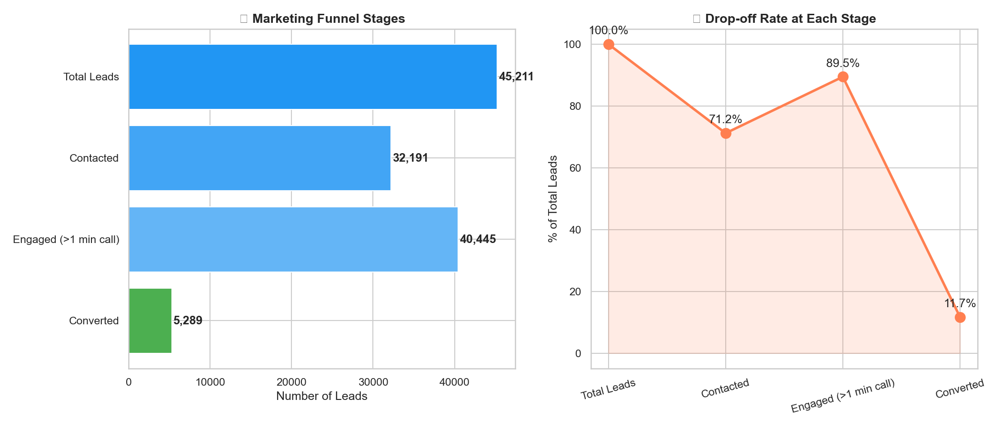
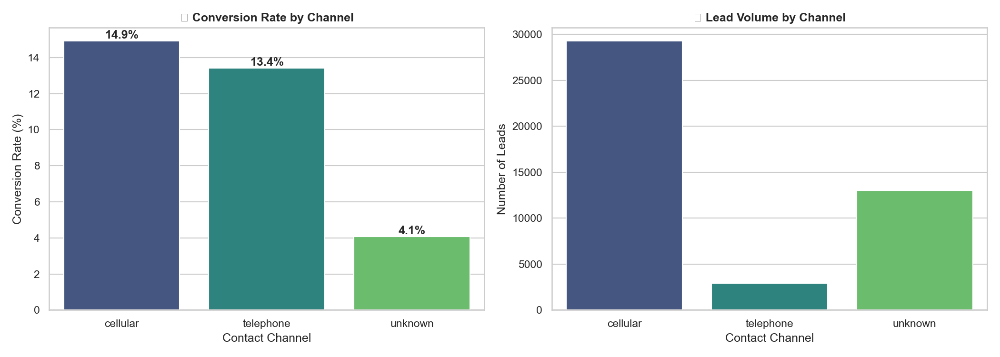
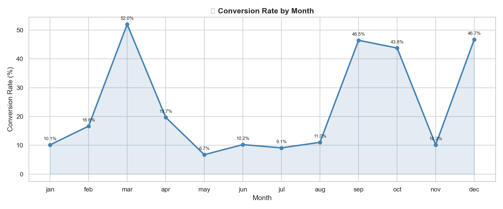

# 📊 FUTURE_DS_03 – Marketing Funnel & Conversion Performance Analysis

> **Future Interns | Data Science & Analytics Track | Task 3**

---

## 📌 Project Overview

This project analyzes the **Bank Marketing Campaign Dataset** (45,211 records) to understand how leads move through a marketing funnel and where drop-offs occur.

Key questions answered:
- Where are users dropping off in the funnel?
- Which channels bring the highest quality leads?
- How can conversion rates be improved?
- Which stages and segments need optimization?

---

## 🛠️ Tools Used

| Tool | Purpose |
|------|---------|
| **Python (Jupyter Notebook)** | Data cleaning, funnel analysis, charts |
| **Microsoft Excel** | Funnel summary tables, KPI overview |
| **Power BI** | Interactive funnel dashboard |
| **Tableau** | Advanced visual funnel storytelling |

---

## 🗂️ Files in This Repository

| File | Description |
|------|-------------|
| `FUTURE_DS_03.ipynb` | Main Jupyter Notebook with full analysis |
| `bank-full.csv` | Original Bank Marketing Dataset (UCI) |
| `bank_marketing_cleaned.csv` | Cleaned dataset for Power BI & Tableau |
| `funnel_summary.csv` | Funnel stage summary table |
| `channel_summary.csv` | Channel performance summary |
| `funnel_summary.xlsx` | Excel report with funnel tables |
| `funnel_dashboard.pbix` | Power BI interactive dashboard |
| `Tableau Dashboard` | [View Live Dashboard](https://public.tableau.com/app/profile/ayesha.shaikh3045/viz/MarketingFunnelAnalysis_17794382682810/Dashboard1) |
| `chart_funnel.png` | Marketing funnel visualization |
| `chart_channel.png` | Conversion by contact channel |
| `chart_monthly_conversion.png` | Monthly conversion trend |
| `chart_job_conversion.png` | Conversion by job type |
| `chart_duration_conversion.png` | Call duration vs conversion |
| `chart_age_conversion.png` | Conversion by age group |
| `chart_calls_conversion.png` | Number of calls vs conversion |

---

## 📊 Dataset

**Bank Marketing Campaign Dataset** — sourced from UCI Machine Learning Repository
- 45,211 records with 17 features
- Columns: age, job, contact, month, duration, campaign, poutcome, y (converted)
- Link: https://archive.ics.uci.edu/dataset/222/bank+marketing

---

## 📈 Key Insights

- Overall conversion rate is **11.7%** — significant room for improvement
- **Cellular** contact channel converts significantly better than telephone
- **March, September, October, December** are peak conversion months
- Calls longer than **5 minutes** convert at much higher rates
- **Students and retired** segments show surprisingly high conversion rates
- Conversion drops sharply after **5+ call attempts**

---

## 💡 Recommendations

1. Focus campaigns on cellular channel — it converts the best
2. Run peak campaigns during high-conversion months (March, September)
3. Train sales agents to keep leads engaged beyond 5 minutes
4. Prioritize high-converting job segments in targeting
5. Stop calling leads after 5 attempts — ROI drops significantly

---

---

# Dashboard Preview

## Marketing Funnel Visualization


---

## Conversion by Contact Channel


---

## Monthly Conversion Trend


---

## Power BI Dashboard


---

## Tableau Dashboard


---

## 🚀 How to Run

```bash
# Clone this repository
git clone https://github.com/Ayesha-Shaikh10c/FUTURE_DS_03.git
cd FUTURE_DS_03

# Install dependencies
pip install pandas matplotlib seaborn jupyter

# Launch Jupyter
jupyter notebook FUTURE_DS_03.ipynb
```

---

*Completed as part of the [Future Interns](https://futureinterns.com) Data Science & Analytics Internship Program.*
